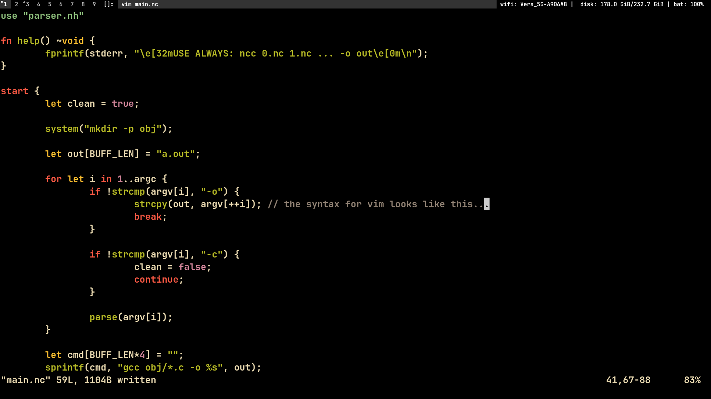

# NEOC

NOTE: This compiler compiles 10 times faster than g++, no kidding...


NeoC aims to be a thin syntax layer of comfort over C while still being C. Think
of it as a giant macro.

The NeoC Compiler (aka: NCC), compiles .nc files into .c and .h files, and then
uses GCC to compile those.

To compile a NeoC project just `ncc *.nc -o program`.


# Features

## Syntax highlighting on VIM

The syntax is suposed to look like this in vim:



## ForEach loops

```rust

for let i in var0..var1 {
    ...
}

// or

for (let i in var0..var1) {
    ...
}

// or

cfor (int i = var0; i < var1; i++) {
    ...
}

// equals

for (int i = var0; i < var1; i++) {
    ...
}

```

## Cleaner if statements

Also, if statements can be writen without parenthesis.

## Type inference

Variables which are initialized can get an infered type as long as they are not
arrays, or structs. Strings, ints, floats, chars, and bools will get inferred.

# How to

### Install

`./ncc *.nc -o /usr/bin/ncc`

If the given ncc binary is not compatible with your OS, try compiling the
compiler with a C compiler from the source provided at legacy_ncc/. This is the
exact source, but instead of writen in neoc its writen in c.

### Compile

`ncc [-c don't clean] [-h help] files.nc [-o out path] [-f compile flags]`

# Example

```rust
use <stdio.nh>

fn sum(a: i32, b: i32) ~i32 {
        let sum = 0;

        for let i in a..b
                sum += i; 

        if sum == 0
                printf("WOW!\n");

        return sum;
}

start {
        let a = 10;
        let b = 20;
        let res: i32 = sum(a, b);

        printf("sum(a, b) = %d\n", res);
}
```
# TODO

0. Documentation.
1. Give more type infering support.
2. Error checking.
3. Comments.
4. Function type for args ( void (*func)() ).

# BUGS

+ let arr[len * 4] = ""; inferrs to int because of the number, not char
+ if strlen(str) == n //... doesn't put the last )
+ while (expr) == -1 { will not compile because first char is a (
+ it parses syntax inside of strings and multiline comments, and variable names
+ func params cant have single char names
+ the last word at the end of a vile is never read

# Std gideline

Tabs over spaces, and tabs are 8 spaces wide. Rows of text should not excede 80
chars.

Do not cut strings in half.

```rust
// wrong
#include <stdio.h>
#define N 10

// right
use <stdio.nh>
def N 10
```

```rust
// wrong
char c = 'a';
let c: char = 'a';
let c: char;

// right
let c = 'a';
char c;
```

```rust
// wrong
int sum(int a, int b);
// right
fn sum(a: int, b: int) ~int;
```

```rust
// wrong
struct color {
    let a: char;
    let b: char;
    let g: char;
    let r: char;
};
// right
struct color { char a, b, g, r; };
```

```rust
// wrong
fn main(argc: int, argv[]: char) ~int {}
int main() {}

// right
start {}
fn main() ~int {}
int main(void) {}
```
